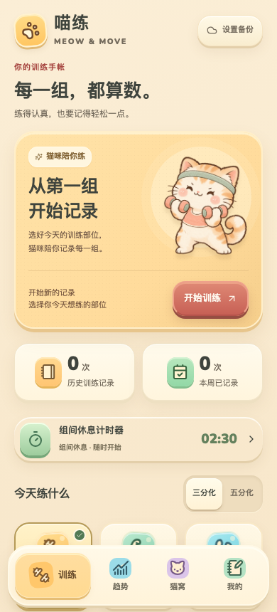
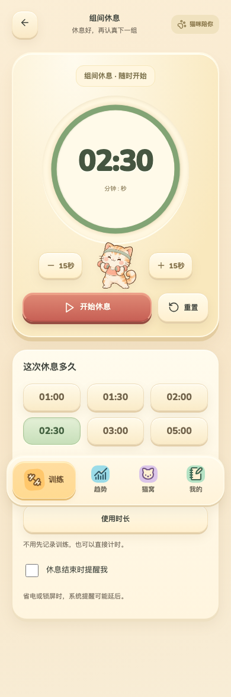
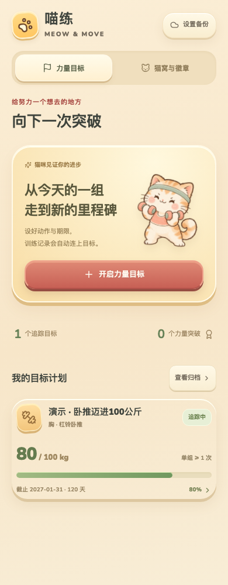
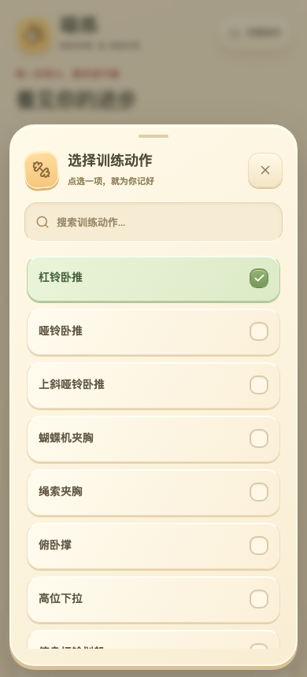

# 喵练 · Meow & Move

[](https://github.com/LOOIZIJIAN/meow-move/actions/workflows/android.yml)

一款猫咪陪伴的 Android 健身训练日志。奶油色卡片、立体按钮与运动猫咪，让训练时记录每一组更轻松。






## 功能

- **训练计划**：三分化推 / 拉 / 腿、五分化胸 / 背 / 腿 / 肩 / 手臂，以及九个部位的自由组合。
- **训练记录**：重量、次数、休息、感受与备注；区分总重量、单边重量、器械读数和自重。
- **统一选择面板**：奶油色厚边按钮、可滚动的选择卡片和浅绿色勾选状态；长动作列表支持搜索，休息时长用双列快捷选择，支持返回关闭与键盘操作。
- **独立休息计时器**：首页直接打开，无需先记录训练；常用 / 自定义时长、暂停 / 继续、加减15秒、重新计时和到点提醒。保存一组后自动启动同一个计时器，切换页面保留迷你计时条，中断后可恢复。
- **训练中使用**：按部位筛选动作、添加自定义动作、沿用上次训练、查看上次成绩；切换动作保留输入，中断后可以继续。
- **分析**：同一动作、握法与重量方式分别比较，查看工作重量、次数、每周频率和部位分布。
- **力量目标与计划**：按部位、指定动作、重量方式和握法设置目标重量 / 次数 / 截止日期；自动关联全部历史同部位训练，实际完成的组更新进度，生成阶段节点、差距、趋势和关联记录。支持同一动作的旧名称、编辑 / 归档 / 恢复、导出给 AI，以及 JSON 自动备份。
- **猫窝**：每周目标、训练次数里程碑、猫咪名字与解锁装扮。
- **导入与导出**：按日期导出 Markdown / CSV，保存或分享给 AI；完整 JSON 备份与合并恢复。
- **自动文件备份**：通过系统文件选择器授权自己的 Google Drive 文件，后续自动更新。

公开版本以空日志和 32 个通用动作启动，不包含使用者的训练记录、原始笔记、账号、备份或签名材料。测试中的笔记均为虚构示例。

## 本地构建

需要 JDK 17、Android SDK Platform 36 和 Node.js。支持 Android 9（API 28）及以上版本；Gradle 8.13 和 Android Gradle Plugin 8.13.2 已固定版本。

```sh
git clone https://github.com/LOOIZIJIAN/meow-move.git
cd meow-move
```

设置 `ANDROID_HOME` 指向本机 Android SDK，或在未跟踪的 `local.properties` 中写入 `sdk.dir=<本机 SDK 路径>`。

```sh
node --test tests/*.test.cjs
./gradlew :app:assembleDebug :app:lintRelease
```

输出：`app/build/outputs/apk/debug/app-debug.apk`。首次构建需要网络下载 Gradle 与 Android 工具；前端资源均已打包，无需 npm 安装。

GitHub Actions 自动运行模型测试、Android 构建与 lint，并提供 `meow-move-debug` APK 构建产物。Debug APK 使用开发签名；已有个人签名版本需要原签名才能更新。

正式签名配置在被 Git 忽略的 `signing/` 目录中：`meow-move.jks` 与 `signing.properties`，后者包含 `storePassword`、`keyPassword`，别名为 `meow-move`。配置完成后运行 `./gradlew :app:assembleRelease`。未配置时 Release 构建也会使用开发签名。签名材料应保留在本机备份中。

## 自动备份与恢复

1. 打开「我的 → 设置自动备份」。
2. 在系统文件选择器的侧栏选择自己的 Google Drive 账号和文件夹。
3. 保存 `meow-move-backup.json`，授予持续写入权限。

App 会更新这个文件，手机上的 Google Drive 文件提供者负责云端上传。「最近写入」表示文件提供者接受了写入；最终远端同步状态以 Drive 为准。如果选择下载目录，界面明确显示「文件自动备份」。网络不可用时保留待备份状态并重试；文件删除或权限撤销后需重新选择。

完整 JSON 包含动作库、训练、原始笔记、目标、猫咪设置和进行中的训练。导入前显示预览，同一训练保留较新的修改；当前进行中的训练优先保留，可以选择是否恢复备份中的偏好设置。

## 力量目标

打开底部「目标 → 开启力量目标」。例如：胸、杠铃卧推、总重量、100 kg、单组至少 1 次，截止 2027-01-31。目标以实际记录达成；90 kg × 10 次不会按估算最大力量判为 100 kg 已完成。

所有同部位训练自动关联作训练背景。力量进度只使用关联动作名称、相同重量方式和握法、明确 kg 单位、足够次数的普通组；其他器械、未注明单位、左右不同次数或递减组保留在日志中。旧记录的名称不同，可以手动选择同一动作的其他名称。

最好成绩和里程碑每次从已保存的组重新计算，包括当前训练已保存的组；未保存的草稿不计入。修改记录、放弃当前训练或合并导入后也会重新计算。已达成显示实际日期，截止后完成标记为逾期达成，未来日期记录不提前计入。

起点参考取计划开始前的最好符合条件成绩；没有历史时，使用首个符合条件训练日的最好成绩。阶段节点按起点到目标的差距和计划时间均分；剩余差距按周均分仅用于查看进度，不作为加重建议或力量预测。没有符合条件的记录时，显示未知值，不当作零。

目标详情可导出 Markdown，包含目标规则、计算、节点和相关训练。普通 Markdown 导出也附带当前目标追踪，目标状态使用截至今天的全部已保存记录；训练日志的日期筛选不改变目标状态。CSV 仍为逐组训练表格。完整 JSON 保存所有目标（含归档）；恢复时按目标 ID 和修改时间合并，较旧备份不会重新启用已归档目标。旧版本没有力量目标的备份仍可导入。

「猫窝与徽章」保留每周频率目标、猫咪名字和装扮。

## 笔记导入格式

可导入带日期标题、动作名称和编号组的 Markdown，例如下面的虚构记录：

```text
# 练胸 2/1/2000
杠铃卧推
1. 20kg*10, 2min
2. 22.5kg*8, 2.5min
下斜推胸（单边）
1. 10kg*10, 2min
2. 10kg*9,
```

未记录的单位或休息保持缺失；左右不同次数和递减组保留原文，复杂组不会并入普通重量趋势。

## 架构

| 文件 | 职责 |
| --- | --- |
| `app/src/main/assets/model.js` | 数据格式、笔记解析、分析、合并和导出 |
| `app/src/main/assets/goals.js` / `goals-ui.js` | 力量目标、动态进度、阶段计划与目标界面 |
| `app/src/main/assets/timer.js` | 独立计时状态、暂停恢复与截止时间计算 |
| `app/src/main/assets/app.js` | 界面、输入与训练流程 |
| `Store.java` | 本机 SQLite 事务与恢复快照 |
| `Backup.java` / `BackupJob.java` | 文件写入与后台重试 |
| `MainActivity.java` | 本地 WebView、文件选择器与原生桥 |
| `RestReceiver.java` | 休息提醒 |
| `ExportProvider.java` | 只读分享文件接口 |

本机 SQLite 保存训练数据；界面、字体、图标和插画随 APK 打包，日常记录离线可用。WebView 仅加载包内资源，CSP 与地址拦截限制外部内容，发布版关闭调试。App 不声明 `INTERNET` 权限，不向开发者服务器上传数据。

计时器支持1秒至60分钟，以实际截止时间计算剩余时间；暂停保留尚余时间，加减15秒仅调整当前一轮。计时器打开并运行时保持屏幕亮起，离开或暂停后恢复系统的息屏设置。备份合并保留本机计时状态，不会启动另一台手机的计时器。

休息倒计时按实际截止时间恢复。可选系统通知；Android 省电或锁屏可能延后后台提醒。

`scripts/generate-seed.cjs` 可重新生成空日志与通用动作库，测试会校验浏览器与 Android 两份初始数据一致。

## 素材与参考

猫咪插画为此 App 生成的专用素材。Nunito 字体采用 SIL Open Font License，Lucide 图标采用 ISC License；原许可证位于 `app/src/main/assets/`。

- [Android 文件选择与持续授权](https://developer.android.com/training/data-storage/shared/documents-files)
- [Android 状态栏与导航栏适配](https://developer.android.com/develop/ui/views/layout/edge-to-edge)
- [Android 通知权限](https://developer.android.com/develop/ui/views/notifications/notification-permission)
